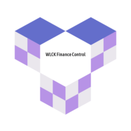

# WLCK FinanceControl

<p align="center">
  
</p>

WLCK Finance Control is a PWA developed to help you on your finance control. Using the application you can register your incomes and outcomes and also plan your monthly expenses.
Techonologies:
- Angular 8
- Firebase

## Techonologies

The interface was developed in Angular and the deployed into firebase.
To run the project, follow the steps below:
1. Create a path named **environments** inside the **src** path.
2. Create two files inside this path: **environment.ts** and **environment.prod.ts**.
3. Copy and paste this information inside this files and change according to your firebase account project:
```diff
export const environment = {
  production: false, // change to true on environment.prod.ts
  firebase: {
    apiKey: "<YOUR FIREBASE PROJECT API KEY>",
    authDomain: "<YOUR FIREBASE AUTH DOMAIN",
    databaseURL: "<YOUR FIREBASE PROJECT DATABASE URL>",
    projectId: "<YOUR FIREBASE PROJECT ID>",
    storageBucket: "<YOUR FIREBASE PROJECT STORAGE BUCKET>",
    messagingSenderId: "<YOUR FIREBASE MESSAGING SENDER ID>",
    appId: "<YOUR FIREBASE APP ID>"
  },
  timeSession: 30, // time to expire the user session in minutes
};
```
4. Run `npm install` to install all the project dependencies.
5. Run `ng serve` for a dev server. Navigate to `http://localhost:4200/`. The app will automatically reload if you change any of the source files.

## Build

Run `ng build` to build the project. The build artifacts will be stored in the `dist/` directory. Use the `--prod` flag for a production build.

## How it works
Access the [app](https://wlck-finance-control.firebaseapp.com/), register your user and start to use. Follow the descriptions below to understand how to use the application.

### Transactions
The control manage is associate with transactions register. There are two types of transaction: income and outcome. Income is every money that enter in your wallet and outcome is every money that leave your wallet.

### Categories
The transactions are categorized in:
1. Gym
2. Supermarket
3. Hobbie
4. Transportation
5. Labor expenses
6. Trip
7. Food
8. Study
9. Ordinary Expenses
10. Services (Telephone, laundry, etc)
11. Home

### Monthly Planning
Plan your month outcomes and incomes and manage your monthly goal!

### History
Monthly history of incomes and outcomes. See all monthly transactions and your goals.
